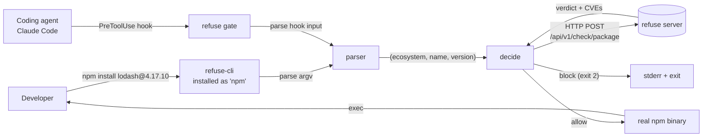

# Architecture

A guided tour of refuse-cli, enough to land a PR without having to read the whole codebase.

## The 30-second version



refuse-cli is a single Go binary with **two modes**:

1. **Shim mode.** Installed as `npm` / `pip` / `yarn` / etc. via symlink. When a user runs `npm install lodash`, the shim is invoked instead, parses the argv, consults the [refuse server](https://github.com/RefuseHQ/refuse), and either exec's the real binary or exits with an explanation.
2. **CLI mode.** Invoked as `refuse` — used to install/uninstall the shim, configure the server URL, install agent hooks, run one-off checks, and so on.

The choice happens in `cmd/refuse/main.go`: we look at `os.Args[0]` to decide which mode to enter.

## Layout

```
cmd/refuse/main.go         # multicall entry
internal/
  cli/                     # Cobra commands
    root.go                #   the `refuse` root command
    gate.go                #   `refuse gate` — the real workhorse
    install.go, hook.go,   #   the rest (some still stubs; see ROADMAP.md)
    init.go, doctor.go, …
  config/config.go         # layered config: defaults → ~/.refuse/config.yaml
                           #                       → ./.refuse.yaml
                           #                       → REFUSE_* env vars
  gate/
    decide.go              # the decision engine — given a parsed install +
                           # a server response, should we allow it?
    protocol.go            # parsing the Claude Code PreToolUse JSON input
    env.go                 # env var helpers (REFUSE_FAIL_CLOSED, REFUSE_POLICY,
                           #                  REFUSE_ALLOW_VULNERABLE)
  hook/
    claudecode.go          # write/remove PreToolUse hook in ~/.claude/settings.json
    registry.go            # multi-agent registry (future: cursor, aider, …)
  parsers/
    types.go               # Mode (Passthrough/Direct/Lockfile), PkgRef, ParseResult
    common.go              # shared argv helpers
    npm.go, pip.go,        # one file per manager. Pure functions.
    yarn.go, …
    registry.go            # name → parser
  server/
    client.go              # HTTP client for the refuse REST API
    types.go               # request/response shapes
  shim/
    shim.go                # KnownManagers map (npm → npm-ecosystem, etc.)
    install.go             # creating/removing symlinks in ~/.refuse/bin
    shellrc.go             # editing PATH lines in shell rc files
    exec.go                # resolving and exec'ing the real binary
    run.go                 # the shim's main loop
  version/version.go       # build-time metadata (ldflags-injected)

scripts/install.sh         # curl-based installer with sha256 verification
.goreleaser.yaml           # release config
```

## Lifecycle of a blocked `npm install`

1. User types `npm install lodash@4.17.10`.
2. Their shell resolves `npm` → `~/.refuse/bin/npm` → symlinked to the refuse binary.
3. Binary boots, sees `os.Args[0] == "npm"`, enters shim mode.
4. `internal/parsers/npm.go::Parse(os.Args)` returns `ParseResult{Mode: Direct, Pkgs: [{npm, lodash, 4.17.10}]}`.
5. `internal/gate/decide.go::Decide` calls the server: `POST /api/v1/check/package`.
6. Server responds with `{vulnerable: true, advisories: [{id: CVE-2019-10744, severity: high, suggested: 4.17.21}], ...}`.
7. `Decide` compares severity (`high`) to threshold (`high`, default) — block.
8. Prints a structured message to stderr and `os.Exit(2)`.

If the package is fine — exit step 7, `internal/shim/exec.go` resolves the real `npm` on PATH (excluding `~/.refuse/bin/`), `syscall.Exec`s it on Unix or `os/exec.Run`s it on Windows, and we're transparent.

## Lifecycle of an agent-driven install

Different entry point, same gate:

1. Claude Code is about to run a Bash tool: `npm install lodash@4.17.10`.
2. Its `PreToolUse` hook fires, calling `refuse gate` with the tool input on stdin (JSON).
3. `internal/gate/protocol.go` parses the JSON, splits compound commands (`&&`, `;`, `|`) with `shlex`, and feeds each one through the parser registry.
4. For each `ParseResult`, `Decide` runs the same check as above.
5. Exit code 0 (allow) or 2 (block). Claude Code respects exit 2 as a hook-side veto.

This is why the parser and decision logic are stateless and pure — they have to work for both invocation styles.

## Config resolution

`internal/config/config.go`. Lowest to highest precedence:

1. Hard-coded defaults (server URL, severity threshold, fail mode).
2. `~/.refuse/config.yaml`.
3. `./.refuse.yaml` (project-scoped).
4. `REFUSE_*` environment variables (override everything; useful in CI).

```yaml
server_url: http://localhost:8080
api_key: ""
policy:
  severity_threshold: high               # low | medium | high | critical
  fail_closed: false                     # true = network errors block the install
  allow_yanked: false
  allow_prerelease: false
  override_env: REFUSE_ALLOW_VULNERABLE
```

## Why one binary, multiple managers?

A single `refuse` binary symlinked to many names is smaller, simpler to release, and easier to debug than a per-manager wrapper. We pay the cost once at install time and the runtime overhead is microseconds.

## Decision matrix

Captured in `internal/gate/decide_test.go`. The high-level rules:

| Server response | Severity ≥ threshold | Fail mode | Result |
| --- | --- | --- | --- |
| Vulnerable | yes | — | **block** |
| Vulnerable | no | — | allow (with advisory in stderr) |
| Clean | — | — | allow |
| Server unreachable | — | fail-open (default) | allow with stderr warning |
| Server unreachable | — | fail-closed | **block** |
| Timeout | — | fail-open (default) | allow with stderr warning |
| Timeout | — | fail-closed | **block** |

Default is fail-open with a loud stderr warning, so an outage of the server doesn't grind every developer's machine to a halt. Operators who want strict CI gates flip `REFUSE_FAIL_CLOSED=1` or set `policy.fail_closed: true`.

## Build & release

- `make build` — `go build` with version/commit/date injected via ldflags.
- `make release-snapshot` — `goreleaser release --snapshot --clean`. Useful for testing the artifact pipeline locally.
- A `v*` tag push triggers `.github/workflows/release.yaml` → goreleaser → GitHub Releases + Homebrew tap update.
- `scripts/install.sh` is the canonical installer for non-brew users.

## What we deliberately don't do

- **No daemon.** No long-running process, no socket. Just the binary and the symlink.
- **No telemetry.** A shim that calls home is unacceptable. The only network call is to the configured `server_url`, and it carries `(ecosystem, name, version)` — nothing about who is running it.
- **No package manager replacement.** We exec the real binary; we never re-implement install logic. If your manager has a bug, refuse won't try to fix it.
- **No retries.** If the server is unreachable, fail-closed is the default. Retries hide misconfiguration.

## Related repositories

- [refuse](https://github.com/RefuseHQ/refuse) — the server that answers the gate's questions.
- [refuse.dev](https://refuse.dev) — the hosted variant; pointed at by default.
